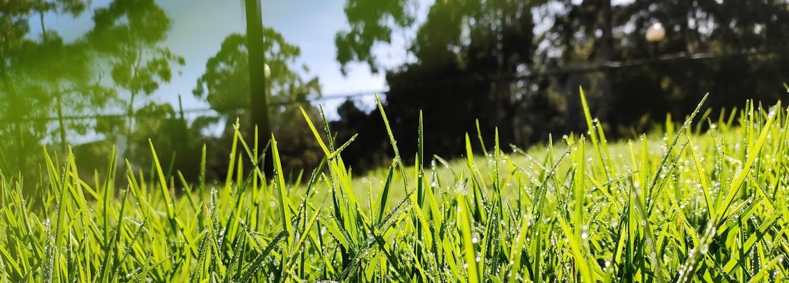
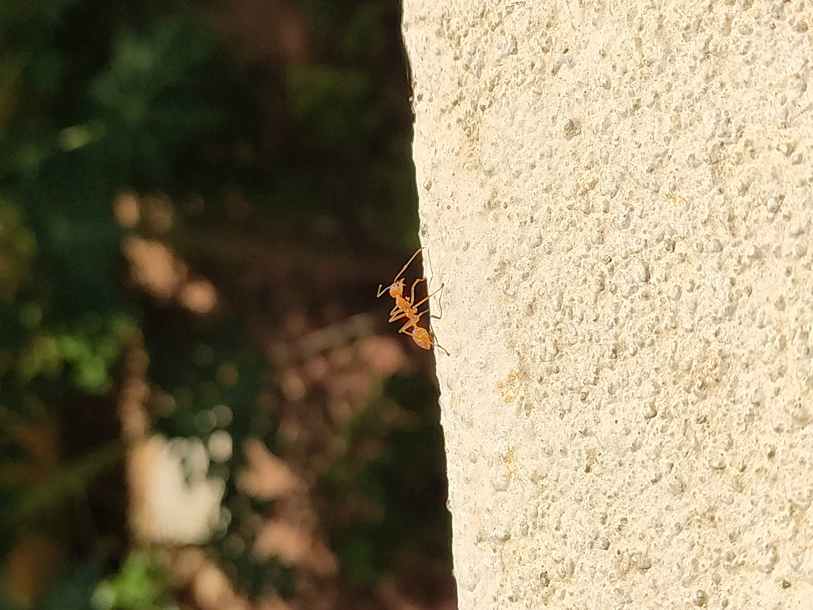
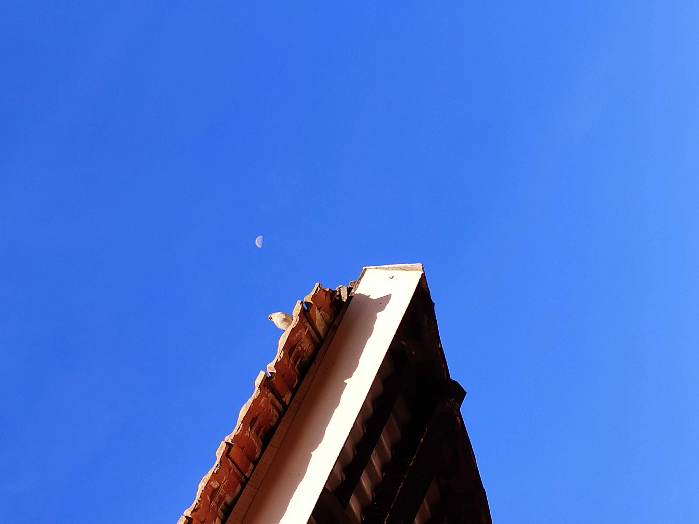

<!--
**barunkumar04/barunkumar04** is a ✨ _special_ ✨ repository because its `README.md` (this file) appears on your GitHub profile.

Here are some ideas to get you started:

- 🔭 I’m currently working on ...
- 🌱 I’m currently learning ...
- 👯 I’m looking to collaborate on ...
- 🤔 I’m looking for help with ...
- 💬 Ask me about ...
- 📫 How to reach me: ...
- 😄 Pronouns: ...
- ⚡ Fun fact: ...
-->

# <i>Hey! I am Barun. Welcome!</i>
A seasoned software engineer, with 12+ years, proficient in all aspects of Software Development Life Cycle. I have a consistent track record of designing, building and maintaining large-scale systems in a multi-tiered, distributed environment.

Currently working at <strong><a href="https://www.jpmorgan.com">J.P. Morgan</a></strong>. Previously worked with <a href="https://www.morganstanley.com">Morgan Stanley</a>, <a href="https://www.hcl.com">HCL</a>, <a href="https://www.oracle.com">Oracle</a> and <a href="https://www.suntecgroup.com">SunTec Business Solutions Pvt. Ltd.</a>  

I post graduated from <a href="https://www.cusat.ac.in">Cochin University</a> with MCA degree in year 2012.

Currently learning - AI/ML & Kafka.

## 🛠️Tech Stack
- 👩‍💻 Programming Languages, Framework and tools
  - Java, Python, PL/SQL
  - Spring Boot, Spring Batch, Spring Data JPA
  - REST API, Microservices, Event Driven
  - AWS, Azure
  - Machine Learning, LLM, RAG, AI Agent
  - System Design, PoCs

## 👨‍💼More about me 
- Born and raised in Bihar. Moved to Kerala for Post Graduation, worked there for ~4 years. And, currently based out of Bengaluru, India.
- One key attribute in me is - Perseverance. 
- My peer and collegues says, I am organized, resposible, technical, resourceful, empathtic and polite.
- I am nature lover. I love driving and exploring places with friends and family.
- I enjoy spending my free time with my kid (4 yo), exploring places, playing sports like badminton and TT.

## ✨ Fun fact 
- The photographer inside me awakens, when I buy a new smart phone :)
- The picture in header one of my mobile clicked photo. Captioned this - "Thousand swards" - resembles, isn't it?
- If you liked that, there are few more such clicks 👇😊 
  

    
<i>The mighty one</i>

     
    
  

  
  

    
<i>Blissful</i>

     
    
  

  
  

    
<i>Edge</i>

     
    
  

  
  

    
<i>Chidiya aur chand</i>

     
    
  

  
  

    
<i>Cloud Partition</i>

     
    
  
  
  
  

    
<i>Hope</i>

     
    
  
  

## 📊My GitHub Stats
  
  

## 📃Certifications
  - AWS practitioner
  - Microsift Azure Fundamentals
  - Big data - from Dataflair

