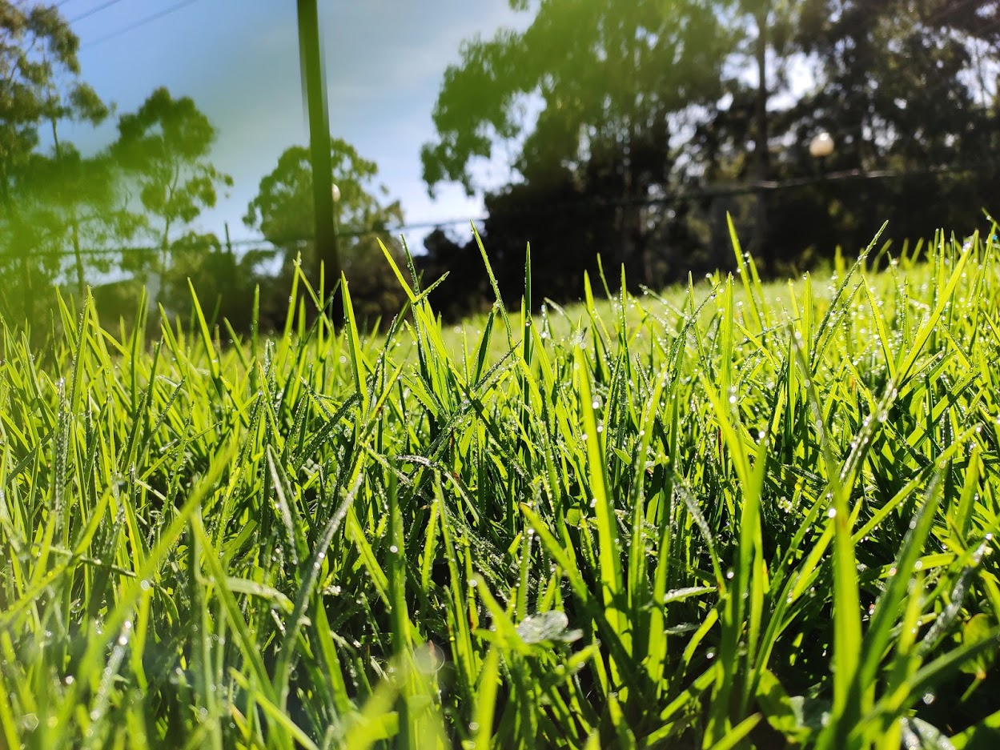

<!--
**barunkumar04/barunkumar04** is a ✨ _special_ ✨ repository because its `README.md` (this file) appears on your GitHub profile.

Here are some ideas to get you started:

- 🔭 I’m currently working on ...
- 🌱 I’m currently learning ...
- 👯 I’m looking to collaborate on ...
- 🤔 I’m looking for help with ...
- 💬 Ask me about ...
- 📫 How to reach me: ...
- 😄 Pronouns: ...
- ⚡ Fun fact: ...
-->

<H2><i>Hey there!</i></H2>

I'm a senior software engineer focused on backend development at <strong><a href="https://www.morganstanley.com">Morgan Stanley</a></strong>. Previously worked with <a href="https://www.hcl.com">HCL</a>, <a href="https://www.oracle.com">Oracle</a> and <a href="https://www.suntecgroup.com">SunTec Business Solutions</a>.  

I have completed MCA from <a href="https://www.cusat.ac.in">Cochin Un</a>

<H3>My values </H3>

<H3>How I work </H3>

<H3>Get in touch </H3>

<H3> My GitHub Stats </H3>
  
  

